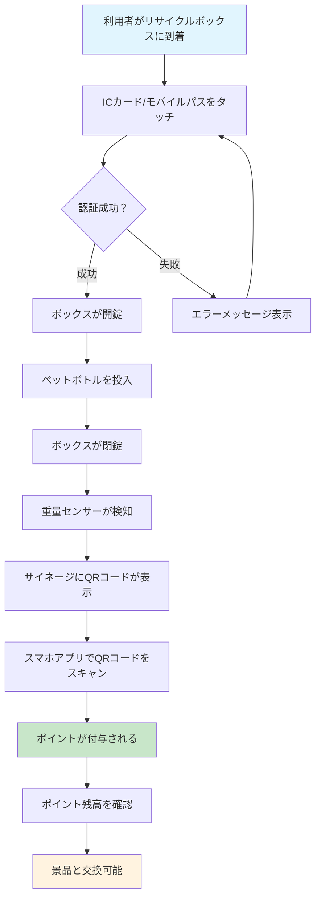
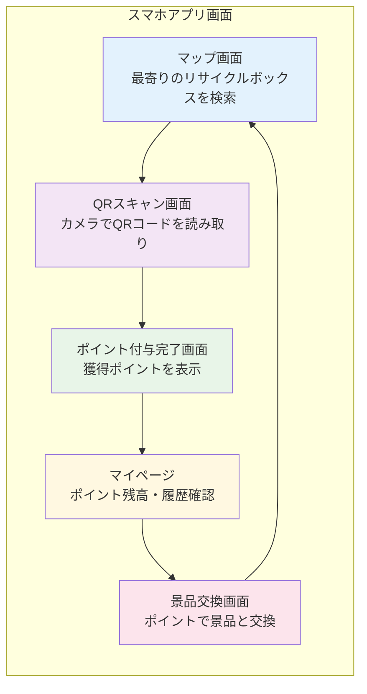
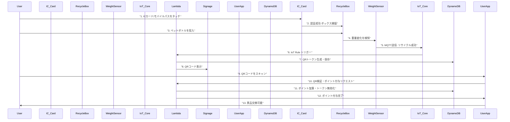
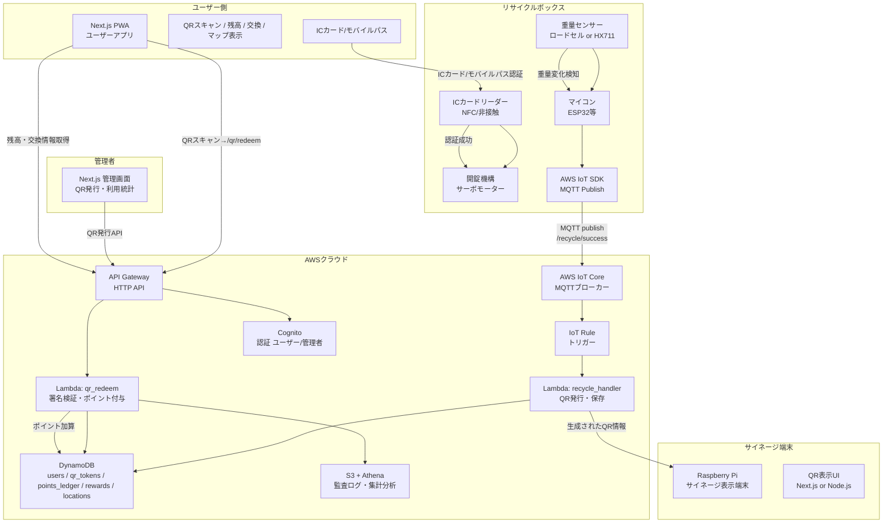
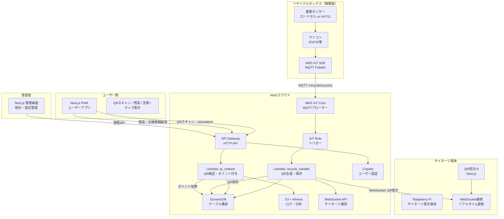

# システム概要と役割

## アーキテクチャ層別構成

| 層 | コンポーネント | 主な機能 |
|---|---|---|
| デバイス層 | 重量センサー + マイコン (ESP32) | 投棄検知 → IoT CoreへMQTT送信 |
| 表示層 | サイネージ端末 (Raspberry Pi) | Lambdaから受け取ったQRを表示 |
| フロントエンド | Next.js (PWA) | QRスキャン、残高確認、ポイント交換、マップ表示 |
| バックエンド | API Gateway + Lambda (TypeScript) | QR発行・検証、ポイント加算、トランザクション処理 |
| データ層 | DynamoDB | users / qr_tokens / points_ledger / rewards / locations |
| 認証層 | Cognito | ユーザー認証・セッション管理 |
| メッセージ層 | AWS IoT Core | センサーイベントのMQTT通信 |
| 監査/分析 | S3 + Athena | イベントログ保管とクエリ分析 |

## 利用者目線でのシステムフロー

### 👤 利用者の具体的な体験

**田中さん（30代会社員）のリサイクル体験**

1. **出勤前の駅で**
   - スマホアプリで最寄りのリサイクルボックスを検索
   - 渋谷駅前のボックスが利用可能と表示

2. **リサイクルボックス到着**
   - ボックスに設置されたICカードリーダーにSuicaをタッチ
   - 「認証成功」の音と共にボックスが開錠

3. **ペットボトル投棄**
   - 空のペットボトルを投入
   - ボックスが自動で閉錠

4. **ポイント獲得**
   - サイネージにQRコードが20秒間表示
   - スマホアプリでQRコードをスキャン
   - 「10ポイント獲得！」の通知が表示

5. **ポイント活用**
   - アプリでポイント残高を確認（累計150ポイント）
   - コンビニの商品券（100ポイント）と交換
   - 残り50ポイントで次回も利用可能

### 🎯 利用者の体験フロー

### 📱 利用者の操作画面フロー

### ⏱️ タイムラインでの利用体験

```mermaid
gantt
    title 利用者のリサイクル体験タイムライン
    dateFormat X
    axisFormat %s
    
    section 到着・認証
    リサイクルボックス到着    :0, 10
    ICカード認証            :10, 15
    ボックス開錠            :15, 20
    
    section 投棄
    ペットボトル投入        :20, 30
    ボックス閉錠            :30, 35
    重量検知                :35, 40
    
    section ポイント獲得
    QRコード表示            :40, 60
    QRスキャン              :60, 70
    ポイント付与            :70, 80
    
    section 確認・交換
    ポイント確認            :80, 90
    景品交換                :90, 120
```

### 💡 利用者にとってのメリット

| メリット | 説明 | 具体例 |
|----------|------|--------|
| **手軽なリサイクル** | 駅や街中で簡単にリサイクル可能 | 通勤途中で空きペットボトルを処分 |
| **ポイント還元** | リサイクルでポイント獲得 | 10回利用で100ポイント、商品券と交換 |
| **環境貢献** | リサイクル活動への参加 | 月10回利用で年間120本のペットボトルをリサイクル |
| **便利なアプリ** | 最寄りのボックス検索・ポイント管理 | マップで最寄りボックスを検索、履歴確認 |
| **即座のフィードバック** | QRスキャンで即座にポイント付与 | 投棄後すぐにポイント獲得を確認 |

### 🎯 システムの価値

**利用者視点**
- リサイクルが楽しく、継続しやすい
- ポイントで実用的な特典を獲得
- 環境活動への参加意識向上

**社会視点**
- 街中のリサイクル率向上
- ペットボトルの適正処理促進
- 持続可能な社会の実現

**事業者視点**
- リサイクルデータの収集・分析
- 利用者の行動パターン把握
- 効果的な環境施策の立案

## リサイクルシステム全体フロー（技術詳細）

## システム構成図

## 実装システム構成図（簡略版）

## データベース設計（DynamoDB）

| テーブル名 | 主キー | 属性 | 用途 |
|---|---|---|---|
| **users** | user_id (String) | email, name, points_balance, created_at, updated_at | ユーザー情報・ポイント残高 |
| **qr_tokens** | token_id (String) | user_id, location_id, points_value, expires_at, status, created_at | QRトークン管理 |
| **points_ledger** | transaction_id (String) | user_id, points_change, transaction_type, qr_token_id, created_at | ポイント取引履歴 |
| **rewards** | reward_id (String) | name, description, points_cost, stock_count, is_active, created_at | 景品マスタ |
| **locations** | location_id (String) | name, address, coordinates, is_active, created_at | リサイクルボックス設置場所 |
| **recycle_events** | event_id (String) | location_id, weight_detected, qr_token_id, created_at | リサイクルイベントログ |

## 実現技術詳細

### フロントエンド
- **Next.js 14**: App Router、Server Components
- **PWA**: Service Worker、オフライン対応
- **QRスキャン**: `@zxing/library`、カメラAPI
- **状態管理**: Zustand
- **UI**: Tailwind CSS + shadcn/ui

### バックエンド
- **API Gateway**: HTTP API v2、CORS設定
- **Lambda**: TypeScript、Node.js 18.x
- **認証**: Cognito User Pool、JWT
- **WebSocket**: API Gateway WebSocket API

### IoT・デバイス
- **ESP32**: Arduino IDE、WiFi接続
- **重量センサー**: HX711 + ロードセル
- **MQTT**: AWS IoT Device SDK
- **Raspberry Pi**: Node.js、WebSocket接続

### データベース
- **DynamoDB**: オンデマンド課金、GSI活用
- **S3**: ログ保存、静的ファイル
- **Athena**: ログ分析、SQLクエリ

### セキュリティ
- **暗号化**: AES-256、HTTPS/WSS
- **認証**: JWT、API Key
- **アクセス制御**: IAM Role、最小権限
