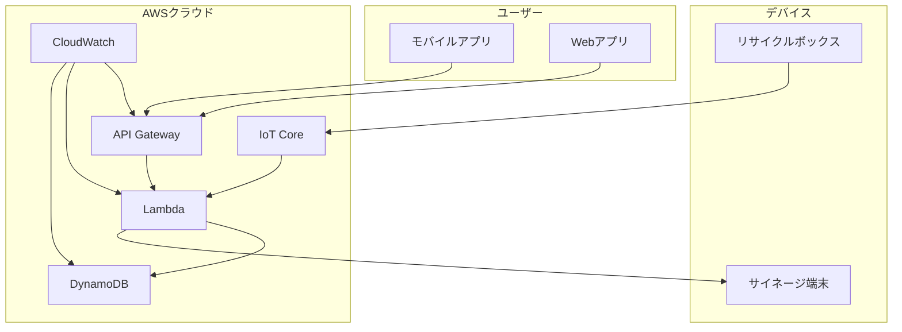

# リサイクルポイントシステム - ドキュメント

## 📚 ドキュメント一覧

### 🏗️ インフラストラクチャ
- [Terraform現在の状態と今後の展望](./terraform-current-state-and-future.md) - 現在の構成と本番運用設計

### 📋 システム設計
- [システム概要](./system-overview.md) - システム全体の概要
- [API仕様書](../api-spec.yaml) - OpenAPI仕様書
- [データベース設計](./database-design.md) - DynamoDBテーブル設計

### 🚀 開発・運用
- [開発環境セットアップ](./development-setup.md) - 開発環境の構築手順
- [デプロイメントガイド](./deployment-guide.md) - デプロイ手順
- [監視・運用ガイド](./monitoring-operations.md) - 監視と運用の手順

## 🎯 クイックスタート

### 1. インフラストラクチャの構築
```bash
# TerraformでDynamoDBテーブルを作成
cd terraform
./scripts/deploy.ps1 dev deploy
```

### 2. 開発環境のセットアップ
```bash
# 必要なツールのインストール
npm install
pip install -r requirements.txt
```

### 3. ローカル開発
```bash
# アプリケーションの起動
npm run dev
```

## 📖 ドキュメントの読み方

### 初心者の方
1. [システム概要](./system-overview.md) - システム全体を理解
2. [Terraform構成詳細解説ガイド](./terraform-detailed-guide.md) - インフラの詳細
3. [開発環境セットアップ](./development-setup.md) - 開発環境の構築

### 開発者の方
1. [API仕様書](../api-spec.yaml) - APIの詳細仕様
2. [データベース設計](./database-design.md) - データベースの設計
3. [Terraformベストプラクティスガイド](./terraform-best-practices.md) - ベストプラクティス

### 運用担当者の方
1. [デプロイメントガイド](./deployment-guide.md) - デプロイ手順
2. [監視・運用ガイド](./monitoring-operations.md) - 監視と運用
3. [Terraform構成アーキテクチャ図](./terraform-architecture-diagram.md) - 構成の理解

## 🔧 技術スタック

### インフラストラクチャ
- **Terraform**: Infrastructure as Code
- **AWS**: クラウドプラットフォーム
- **DynamoDB**: NoSQLデータベース
- **CloudWatch**: 監視・ログ

### アプリケーション
- **Next.js**: フロントエンドフレームワーク
- **TypeScript**: プログラミング言語
- **AWS Lambda**: サーバーレス関数
- **API Gateway**: API管理

### IoT・デバイス
- **ESP32**: マイコン
- **AWS IoT Core**: IoTプラットフォーム
- **MQTT**: 通信プロトコル
- **Raspberry Pi**: サイネージ端末

## 📊 システム構成



## 🎯 主要機能

### 1. リサイクルポイントシステム
- QRコード生成・スキャン
- ポイント付与・管理
- 景品交換

### 2. ユーザー管理
- ユーザー登録・認証
- ポイント残高管理
- 取引履歴

### 3. 管理機能
- 景品管理
- 統計・分析
- システム監視

## 📈 スケーラビリティ

### 現在の対応規模
- **ユーザー数**: 1,000人
- **リサイクルボックス**: 10台
- **1日の取引**: 1,000件

### 将来の拡張計画
- **ユーザー数**: 100,000人
- **リサイクルボックス**: 1,000台
- **1日の取引**: 100,000件

## 🔒 セキュリティ

### データ保護
- 暗号化（保存時・転送時）
- アクセス制御
- 監査ログ

### 認証・認可
- JWT認証
- 最小権限の原則
- 多要素認証

## 💰 コスト最適化

### 開発環境
- オンデマンド課金
- 最小限のリソース
- 自動シャットダウン

### 本番環境
- プロビジョンド課金
- 自動スケーリング
- リザーブドインスタンス

## 📞 サポート

### ドキュメント
- このREADME
- 各ドキュメントファイル
- コメント・コード内ドキュメント

### コミュニケーション
- **GitHub Issues**: バグ報告・機能要求
- **Slack**: #recycle-system-support
- **メール**: support@recycle-system.com

### 緊急時
- **オンコール**: 24/7対応
- **エスカレーション**: 技術責任者
- **復旧手順**: 障害対応ガイド

## 📝 更新履歴

| バージョン | 日付 | 変更内容 |
|---|---|---|
| v1.0.0 | 2024-01-01 | 初期リリース |
| v1.1.0 | 2024-01-15 | 監視機能追加 |
| v1.2.0 | 2024-02-01 | セキュリティ強化 |

## 🤝 貢献

### 開発への参加
1. リポジトリをフォーク
2. フィーチャーブランチを作成
3. 変更をコミット
4. プルリクエストを作成

### ドキュメントの改善
1. 不明な点をIssueで報告
2. 改善提案をプルリクエストで送信
3. 翻訳の協力

## 📄 ライセンス

このプロジェクトはMITライセンスの下で公開されています。

---

**最終更新**: 2024年1月15日  
**バージョン**: v1.2.0  
**メンテナー**: バックエンドチーム
