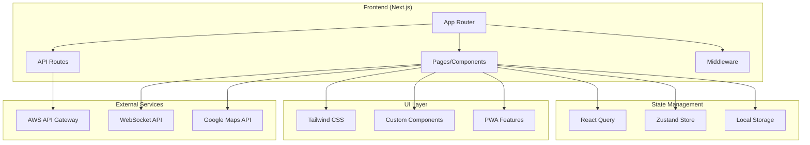

# フロントエンドアーキテクチャ設計

## 概要

リサイクルポイントシステムのフロントエンドアーキテクチャ設計書です。
Next.js + TypeScript + Tailwind CSS + Biome を使用したモダンなWebアプリケーション構成です。

## 技術スタック

### コア技術
- **Next.js 14.2.5** - Reactフレームワーク（App Router）
- **TypeScript** - 型安全性
- **Tailwind CSS** - ユーティリティファーストCSS
- **Biome** - Linter + Formatter + Import整理

### 追加予定技術
- **React Query** - サーバー状態管理
- **Zustand** - クライアント状態管理
- **html5-qrcode** - QRコードスキャン
- **Leaflet** - マップ表示
- **PWA** - プログレッシブWebアプリ

## アーキテクチャ図



## ディレクトリ構成

```
frontend/
├── src/
│   ├── app/                    # App Router
│   │   ├── (auth)/            # 認証関連ページ
│   │   │   ├── login/
│   │   │   └── register/
│   │   ├── (dashboard)/       # ダッシュボード
│   │   │   ├── map/           # マップ表示
│   │   │   ├── scan/          # QRスキャン
│   │   │   ├── points/        # ポイント管理
│   │   │   └── rewards/       # 景品交換
│   │   ├── api/               # API Routes
│   │   ├── globals.css
│   │   ├── layout.tsx
│   │   └── page.tsx
│   ├── components/            # 再利用可能コンポーネント
│   │   ├── ui/               # 基本UIコンポーネント
│   │   │   ├── Button.tsx
│   │   │   ├── Input.tsx
│   │   │   └── Modal.tsx
│   │   ├── map/              # マップ関連
│   │   │   ├── MapView.tsx
│   │   │   ├── LocationList.tsx
│   │   │   └── LocationCard.tsx
│   │   ├── qr/               # QR関連
│   │   │   ├── QRScanner.tsx
│   │   │   └── QRDisplay.tsx
│   │   └── layout/           # レイアウト
│   │       ├── Header.tsx
│   │       ├── Navigation.tsx
│   │       └── Footer.tsx
│   ├── lib/                  # ユーティリティ
│   │   ├── api.ts            # API呼び出し
│   │   ├── auth.ts           # 認証
│   │   ├── qr-scanner.ts     # QRスキャン
│   │   ├── map-utils.ts      # マップユーティリティ
│   │   └── utils.ts          # 汎用ユーティリティ
│   ├── hooks/                # カスタムフック
│   │   ├── useAuth.ts
│   │   ├── useLocations.ts
│   │   ├── useQRScanner.ts
│   │   └── useWebSocket.ts
│   ├── stores/               # Zustandストア
│   │   ├── authStore.ts
│   │   ├── locationStore.ts
│   │   └── pointsStore.ts
│   ├── types/                # TypeScript型定義
│   │   ├── api.ts
│   │   ├── auth.ts
│   │   ├── location.ts
│   │   └── qr.ts
│   └── styles/               # スタイル
│       ├── globals.css
│       └── components.css
├── public/                   # 静的ファイル
│   ├── manifest.json         # PWA設定
│   ├── sw.js                # Service Worker
│   └── icons/               # PWAアイコン
├── docs/                    # ドキュメント
├── biome.json              # Biome設定
├── package.json            # 依存関係
├── tailwind.config.ts      # Tailwind設定
├── tsconfig.json           # TypeScript設定
└── next.config.mjs         # Next.js設定
```

## 主要機能

### 1. 認証システム
- **Cognito統合** - AWS Cognitoによる認証
- **セッション管理** - JWT トークン管理
- **認証ガード** - ページレベル認証

### 2. マップ機能
- **位置情報表示** - リサイクルボックス位置
- **インタラクティブマップ** - クリック・ズーム対応
- **位置選択** - リサイクル実行場所選択

### 3. QRコード機能
- **QRスキャン** - カメラによるQRコード読み取り
- **QR表示** - サイネージ用QRコード表示
- **バリデーション** - QRコード有効性チェック

### 4. ポイント管理
- **ポイント表示** - 現在のポイント残高
- **履歴表示** - ポイント獲得履歴
- **景品交換** - ポイントを使った景品交換

### 5. PWA機能
- **オフライン対応** - 基本的な機能のオフライン利用
- **プッシュ通知** - ポイント獲得通知
- **ホーム画面追加** - ネイティブアプリ風体験

## データフロー

### 1. 認証フロー
```
ユーザー → ログインページ → Cognito認証 → JWT取得 → ダッシュボード
```

### 2. マップ表示フロー
```
ページロード → API呼び出し → 位置情報取得 → マップ表示 → 位置選択
```

### 3. QRスキャンフロー
```
カメラ起動 → QRコード検出 → バリデーション → API呼び出し → ポイント付与
```

### 4. リサイクル実行フロー
```
位置選択 → リサイクル実行 → QR生成 → サイネージ表示 → スキャン → ポイント付与
```

## 状態管理戦略

### サーバー状態（React Query）
- 位置情報
- ユーザー情報
- ポイント履歴
- 景品情報

### クライアント状態（Zustand）
- 認証状態
- UI状態（モーダル、ローディング）
- 選択中の位置
- フォーム状態

### 永続化（Local Storage）
- ユーザー設定
- オフラインキャッシュ
- 認証トークン

## パフォーマンス最適化

### 1. コード分割
- ページレベル分割
- コンポーネントレベル分割
- 動的インポート

### 2. 画像最適化
- Next.js Image コンポーネント
- WebP形式対応
- 遅延読み込み

### 3. キャッシュ戦略
- React Query キャッシュ
- Service Worker キャッシュ
- CDN キャッシュ

## セキュリティ対策

### 1. 認証・認可
- JWT トークン検証
- ページレベル認証ガード
- API エンドポイント保護

### 2. データ保護
- HTTPS 強制
- XSS 対策
- CSRF 対策

### 3. 入力検証
- クライアントサイド検証
- サーバーサイド検証
- 型安全性（TypeScript）

## 開発・デプロイ

### 開発環境
- ホットリロード
- TypeScript 型チェック
- Biome コード品質チェック
- エラーバウンダリ

### 本番環境
- 静的サイト生成（SSG）
- サーバーサイドレンダリング（SSR）
- エッジデプロイ
- 監視・ログ

## 今後の拡張予定

### 1. 機能拡張
- 多言語対応
- ダークモード
- アクセシビリティ向上
- パフォーマンス監視

### 2. 技術アップグレード
- React 19対応
- Next.js 15対応
- 新しいWeb標準対応

### 3. 統合拡張
- ソーシャルログイン
- 決済システム統合
- 分析ツール統合
